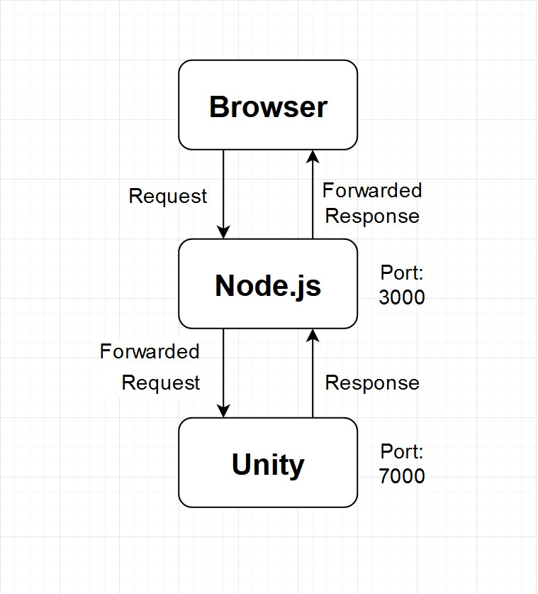
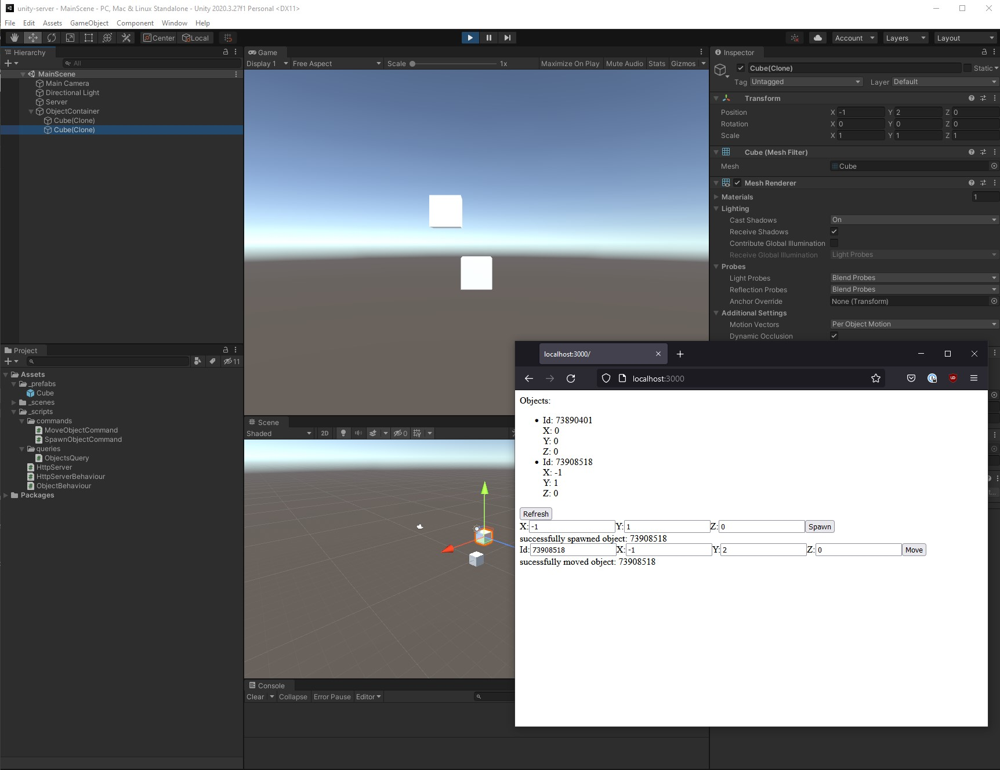

# Intro

`unity-web-server` is an example project showing how you can use a web server hosted within Unity plus a Node.js React Web UI to remotely query and issue commands to Unity.

The example showcases creating, moving, and listing the objects inside a Unity scene while the game is running.

How the interface works is as follows:



- A request is made on the web UI to the Node.js proxy server
  - The request is remapped and sent to the web server running inside of Unity
- Unity processes the request and queues it so it can be processed within the next game loop
  - We process the request and respond back
- The Node.js proxy receives the response and forwards it to the UI

Just like that, we've created an interactive loop that we can issue commands and queries to a Unity instance that is running.

# Getting Started

If you want to start up the project, you need to do two things:

## unity-server

- Load up the Unity editor and open the project stored in the `unity-server` folder
- Make sure you have the `MainScene` open
- Click play button inside Unity to start the game simulation (usually in the center top of Unity Editor UI)

## client

- Once Unity is running the game simulation you can start the web UI client
- Open a terminal in the `client` folder and run the following commands

  ```
  npm install
  npm run start
  ```

  - **NOTE:** subsequent runs will only need to call `npm run start` to build and run the Node.js proxy and web UI. (i.e. you only need to run `npm install` once)

- Open a browser and navigate to: http://localhost:3000/
- Congrats, you should be staring at a web UI to control Unity! Try spawning some objects, moving them, and refreshing for the list of current objects in the scene!

